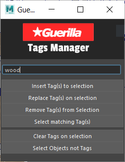

# GuerillaTags


Small UI to add and remove GuerillaTags in your maya scene.



## Install

Copy the `GuerillaTags/` folder to your local `maya/scripts`.

Create a python shelf with the following code (you can use included icons for the shelf):

```python
import GuerillaTags
reload(GuerillaTags)

# Instanciate UI
GuerillaTags.GuerillaTagsWindow()
```

## Features

* [x] Support for operation on multiple tags (comma-separated) at once
* [x] Edition of tags on selected object (clear, remove, insert, replace)
* [x] Select objects including current tags
* [ ] Select objects with no tags (currently broken)
* [ ] Display all tags present in the scene


## Credits

Original script was kindly shared by TIMOTHEY#1953 on the Guerilla Discord.

Guerilla discord invitation link: https://discord.gg/bX2CaYq
